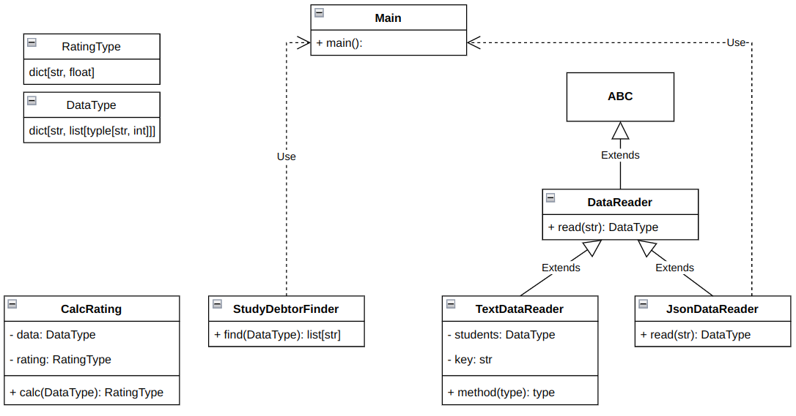

# Лабораторная работа 1 по дисциплине "Технологии программирования"

## Вариант 4

### Формат ввода: JSON
### Задание
Рассчитать и вывести на экран количество студентов,
имеющих академические задолженности (имеющих балл
< 61 хотя бы по одному предмету).

## UML диаграмма классов

## Лицензия

MIT